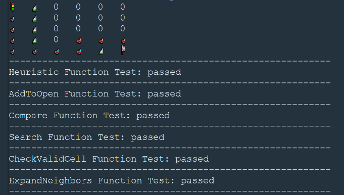

# a_star_search
A* Search on an ASCII board written in C++
![]

The A* search is widely used in map applications for pathfinding. In this example, we feed the program a board with ASCII obstacles, a start and a goal.  

To build this project, make sure you have the g++ compiler for your system. Clone the repo, cd into this folder and run 

```
g++ main.cpp
./a.out
```
(or whatever the format of the resulting executable (.exe for windows)).

For more on the algorithm, please see the Wikipedia [article](https://en.wikipedia.org/wiki/A*_search_algorithm).

